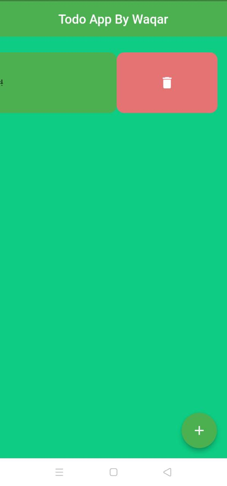
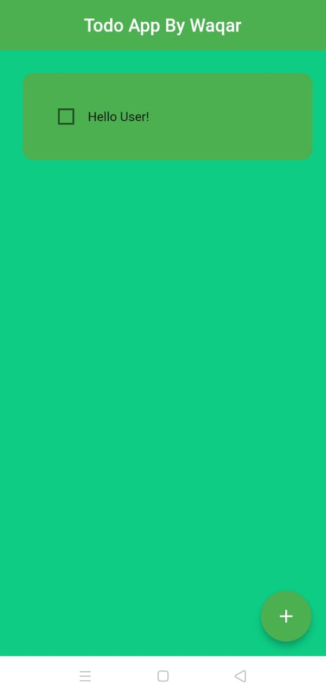
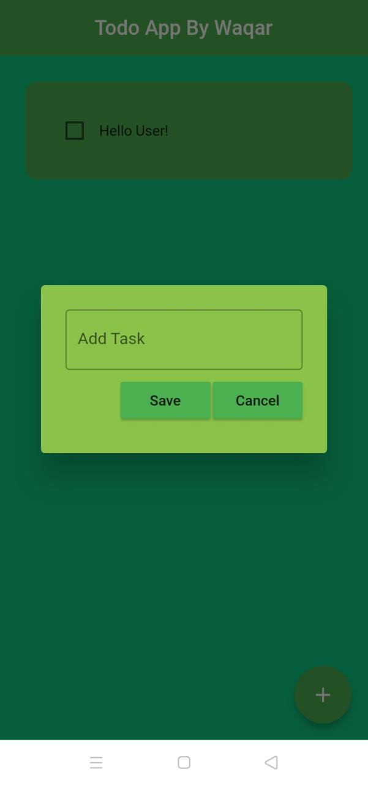
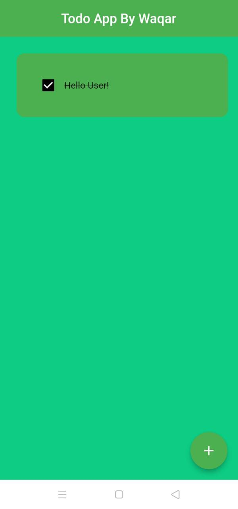

# todoapp

A simple todo App that can create task, market complete and delete the task when you want!

## Running Procedure
- Clone the repo using `git clone url`
- then you `flutter pub get`
- last `flutter run`

## Requirements from pub.dev
- Flutter sideable : slide animation to delete Any task
- hive for storage : using internal storge as Database
- Hive flutter
- Flutter launcher icons : for creating custom icons for both platforms.
- build runner : for hive 
- hive generator : for hive
 
<h1>AppScreens</h1>

